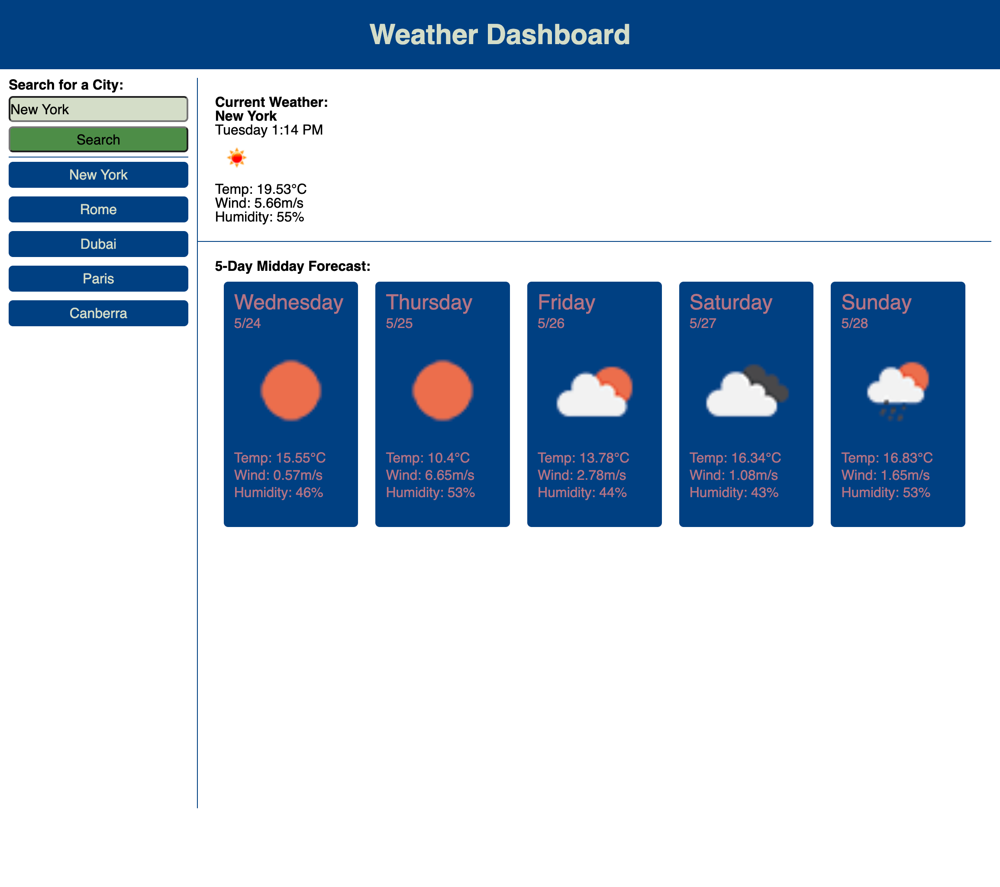

Certainly! Here's an updated version of the README file with emojis added:

```markdown
# 🌤️ Weather Dashboard

The Weather Dashboard is a web application that allows users to search for the current weather and a 5-day midday forecast of a specific city. It utilizes the OpenWeatherMap API to fetch weather data and display it in a user-friendly interface.

## Features

- 🔍 Search for a city: Enter the name of a city in the search input and click the "Search" button to retrieve the current weather and forecast for that city.
- 📚 Search history: The application keeps track of the last 5 searched cities, which are displayed in the search history section. Clicking on a city in the history will reload the weather information for that city.
- 🌡️ Current Weather: The current weather section displays the location, date, weather symbol, temperature, wind speed, and humidity for the searched city.
- 📅 5-Day Midday Forecast: The forecast section shows the midday weather forecast for the next 5 days, including the day of the week, weather symbol, temperature, wind speed, and humidity.

## Technologies Used

- 🌐 HTML
- 🎨 CSS
- 📜 JavaScript
- 🌐 OpenWeatherMap API

## Usage

1. 📥 Clone the repository or download the project files.
2. 🌐 Open the `index.html` file in a web browser.
3. 🔍 Enter the name of a city in the search input and click the "Search" button.
4. ⛅ The current weather and forecast for the specified city will be displayed.
5. 📚 The search history will be updated with the searched city.
6. 🖱️ Click on a city in the search history to reload the weather information for that city.

## API Key

The application requires an API key from OpenWeatherMap to access weather data. If you plan to modify or use this project, make sure to replace the `APIKey` variable in the JavaScript code with your own valid API key. You can obtain an API key by signing up at [OpenWeatherMap](https://openweathermap.org/) and following their documentation.

## Credits

- 🌤️ Weather data: [OpenWeatherMap](https://openweathermap.org/)

## License

This project is licensed under the [MIT License](LICENSE).
```

## Screenshot


## Link to deployed website
[Website Link](https://riskthatbiscuit.github.io/WorkDayCalendar/)